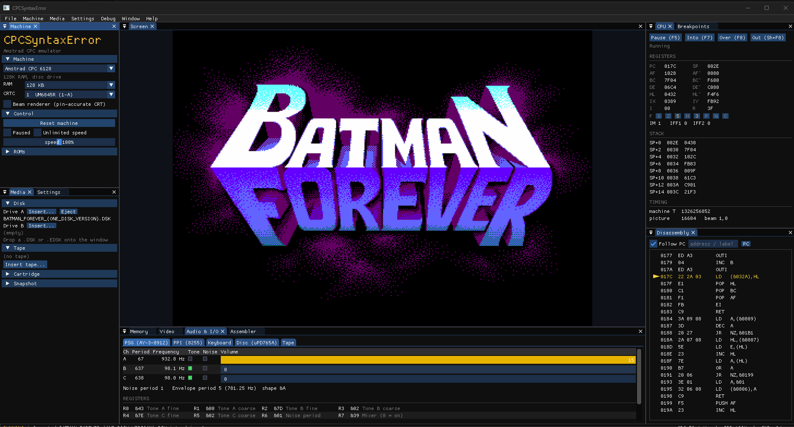
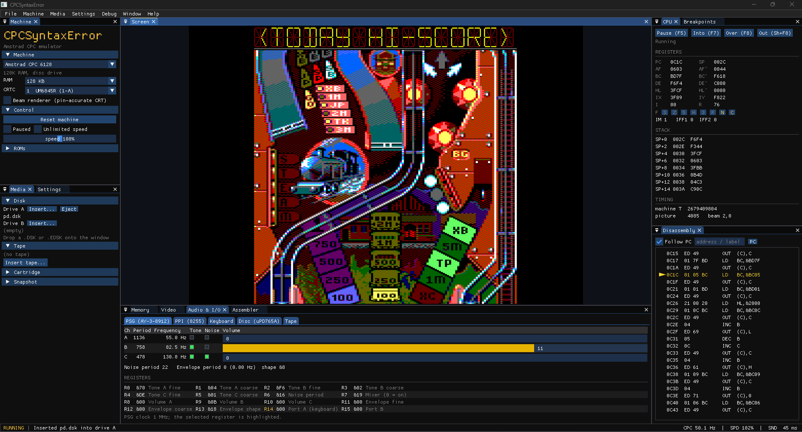
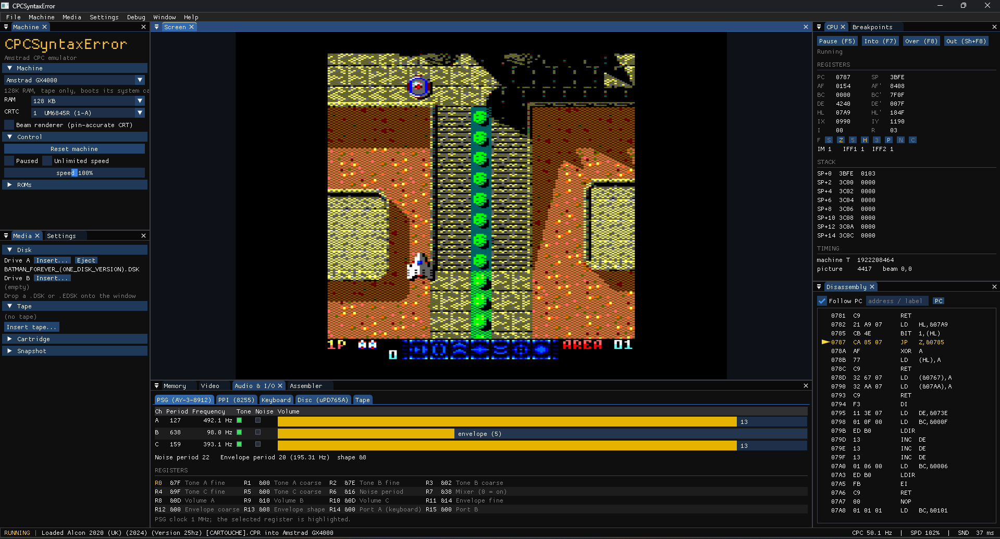
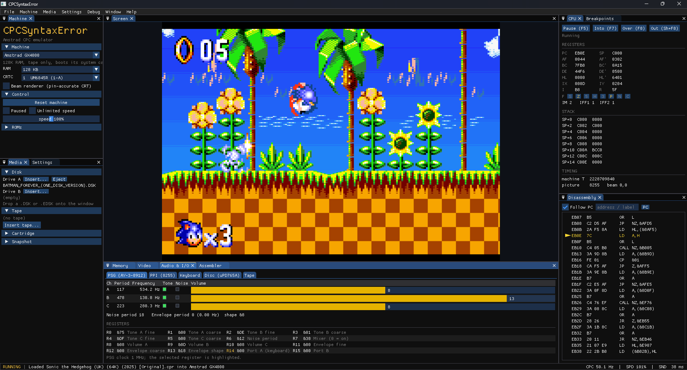

# CPCSyntaxError

An Amstrad **CPC 464 / 6128, CPC Plus and GX4000** emulator for Windows, built
around a cycle-level model of the machine's video chips.

> **Work in progress.** The CRTC, Gate Array and monitor emulation is the mature part
> of the project. The user interface and most expansion hardware are still being
> worked on -- see [Project status](#project-status).

- **All five CRTC types** (0 HD6845S/UM6845, 1 UM6845R, 2 MC6845, 3 and 4 the
  Plus/cost-down ASICs), each with its own rule set taken from Longshot's
  *Amstrad CPC CRTC Compendium* and checked against his SHAKER test suite and
  photographs of real machines.
- **Gate Array** models 40007 / 40008 / 40010 and the ASICs 40226 / 40489,
  with per-model pixel timing, and a **monitor** model (CTM 640/644, CM14, GT 64/65,
  MM12) that locks to the composite sync the Gate Array really produces.
- **CPC Plus ASIC**: sprites, DMA sound, 4096-colour palette, raster interrupts,
  split screen, soft scroll.
- Disc (DSK/EDSK), tape (CDT/TZX/WAV), cartridge (CPR) and snapshot (SNA) loading,
  joysticks and game controllers.
- A **debugger**: breakpoints with conditions, memory watchpoints, step
  into / over / out, disassembly with labels, hex editor, and live views of the
  CRTC, Gate Array, monitor, Plus ASIC, PSG, PPI, keyboard matrix, disc
  controller and tape.
- **CSL scripts and SSM screenshots** (Longshot's CPC Script Language 1.4 and ScreenShot
  Management 1.1): `cpcse.exe --csl <script>` plays a script with no window and saves the
  screenshots the running program asks for -- which is how SHAKER's own scripts drive
  every test. See [CSL scripts](#csl-scripts-and-ssm-screenshots).
- A built-in **assembler**: [RASM](https://github.com/EdouardBERGE/rasm) itself,
  linked in. Assemble straight into the running machine's memory (F9) and run it
  (Ctrl+F9).
- Dockable, resizable windows (Dear ImGui docking branch); any window can be pulled
  out of the main window into its own.

## Screenshots

| | |
|---|---|
|  |  |
| *Batman Forever -- CPC 6128* | *Pinball Dreams -- CPC 6128* |
|  |  |
| *Alcon 2020 -- GX4000* | *Sonic the Hedgehog -- GX4000* |

## Getting started

1. Download `CPCSyntaxError-win64.zip` from the
   [Releases](../../releases) page, unzip it anywhere and run `cpcse.exe` -- or build
   it yourself (below).
2. The CPC 464 and 6128 firmware ROMs and the CPC Plus / GX4000 system cartridge are
   included, in `roms/` (Amstrad have kindly given their permission for the
   redistribution of their copyrighted material but retain that copyright). The release
   zip has them beside `cpcse.exe`, and a source build copies them there. `cpcse.exe`
   looks for a `roms` folder in its working directory; another can be chosen with
   **File → ROM folder…** or `cpcse.exe --roms <folder>`. Files are found by name
   (case does not matter):

   | Machine | Files needed (name must contain) |
   |---|---|
   | CPC 464 | `464 OS`, `464 BASIC` |
   | CPC 6128 | `6128 OS`, `6128 BASIC`, `AMSDOS` |
   | 464 Plus / 6128 Plus / GX4000 | the Plus system cartridge, a `.cpr` whose name contains `burning rubber` |

3. Pick a machine from **Machine → Model**, and load software from the **File** or
   **Media** menus, or drop a file onto the window.

Settings are saved to `cpcse.ini`, and the window layout to `cpcse_layout.ini`, next
to the executable. **Window → Reset layout** restores the default arrangement.

## Keys

| Key | Action |
|---|---|
| F11 | fullscreen (or double-click the picture) |
| Ctrl+R | reset |
| Ctrl+P | pause / run |
| F5 | run / pause (in a debugger window, or while paused) |
| F7 / F8 / Shift+F8 | step into / over / out |
| F9 / Ctrl+F9 | assemble / assemble and run (assembler window) |

Keys go to the CPC unless a debugger or assembler window has the focus.

## Command line

`cpcse.exe --roms <folder>` starts with another ROM folder. A headless screenshot
mode is also available for scripting:

```
cpcse.exe --shot out.bmp --model cpc6128 --frames 200 [--disk game.dsk] [--type "RUN\"GAME\n"]
          [--cart file.cpr] [--tape file.cdt] [--sna file.sna] [--crtc 0-4] [--beam]
```

Models: `cpc464`, `cpc6128`, `cpc464plus`, `cpc6128plus`, `gx4000`.

The headless modes print to the Command Prompt they were started from. `cpcse.exe` is a
windowed program, so the prompt does not wait for it: use `start /wait cpcse.exe ...` in
a batch file that needs the result.

## CSL scripts and SSM screenshots

`cpcse.exe --csl <script>` plays a CPC Script Language file with no window, writing the
screenshots the emulated program requests with SSM codes (the Z80 bytes `ED LL ED HH`) as
`CPCSE_<crtc>_<HHLL>.bmp` -- the naming the SSM standard suggests for the SHAKER portal.
Nothing of it runs unless `--csl` is given.

```
cpcse.exe --csl SHAKE27A-1.CSL --out shots --disk-dir <folder with shaker27.dsk>
```

| Option | |
|---|---|
| `--out <dir>` | screenshots, snapshots and `csl.log` (default `screenshots`) |
| `--roms <dir>` | firmware and the Plus system cartridge (default `roms`) |
| `--disk-dir`, `--tape-dir <dir>` | where to look for the media a script names |
| `--model <id>` | the machine for a script with no `cpc_model` (default `cpc6128`) |
| `--crtc <n>` | override every `crtc_select` (0-4) |
| `--emu-name <name>` | the image name prefix (default `CPCSE`) |
| `--csl-log <file>` | the log of the run (default `<out>/csl.log`) |
| `--no-chain` | do not follow `csl_load` |
| `--no-errata` | play published scripts exactly as written (see below) |

Every CSL 1.4 instruction is handled: machine configuration (`cpc_model`, `crtc_select`
0/1/1A/1B/2/3/4, `gate_array`, `memory_exp`, `rom_dir`, `rom_config`), `reset soft|hard`,
disc, tape and snapshot media and folders, keys (`\(...)` codes, `{groups}`, `\(KOF)`,
`key_from_file`, `keyboard_write`), the four waits, screenshots and snapshots (versions
1-3) with their names and folders, and `csl_load`. `crtc_select 3` with no model builds a
6128 Plus (the CRTC 3 is its ASIC) and takes it from its menu to BASIC before the script
starts. SSM `#0000` ends a `wait_ssm0000`, `#FFFE` saves the named screenshot, `#FFFF` a
snapshot. Anything the machine cannot do stops the script with the standard's report:
script, line, instruction, reason, the script's CSL version and the supported one.

**Erratum.** SHAKER 2.7 added a ninth sub-test to its test U ("R4 & R9 check") that the
SHAKE27A-*.CSL scripts were not updated for: the test now ends 14.2-14.7 s after its key,
the script moves on after 14 s, and the five AI screens that follow are never reached. The
player lengthens that one wait to 16 s and says so in the log; `--no-errata` turns it off.

## Building from source

Requirements: Windows, a MinGW-w64 GCC with C++17 (GCC 10 or later), CMake 3.16+,
Ninja (optional), and the **SDL2 MinGW development package**
(`SDL2-devel-2.x.x-mingw.zip` from <https://github.com/libsdl-org/SDL/releases>).

```
cmake -S . -B build -G Ninja -DSDL2_ROOT=C:/path/to/SDL2-2.x.x/x86_64-w64-mingw32
cmake --build build
```

or unpack the SDL2 package's `x86_64-w64-mingw32` folder into `third_party/SDL2` and
run `build.bat`. The result is `build/cpcse.exe`, with `SDL2.dll` and the `roms`
folder copied beside it; the GCC runtime is linked statically, so nothing else is
needed to run it.

## Source layout

```
src/core/      the emulation core (static library, no host dependencies)
src/gui/       the desktop front end: SDL2 + OpenGL + Dear ImGui, debugger, assembler
roms/          Amstrad firmware and the Plus system cartridge (see roms/README.txt)
third_party/   Dear ImGui (docking branch) and RASM, vendored; SDL2 is fetched separately
```

## Project status

| Area | State |
|---|---|
| CRTC types 0-4, Gate Array, monitor | Mature: rule sets from the Compendium, cross-checked by independent reference models and SHAKER |
| Z80, PSG, PPI, disc controller, tape | Working; not yet audited to the same depth as the video chips |
| CPC Plus ASIC | Working; its picture goes through the same monitor model as a CPC's |
| CSL / SSM | Complete (CSL 1.4, SSM 1.1) |
| **User interface** | **Incomplete** -- new and still being refined; expect rough edges and changes |
| **M4 board** | **Incomplete** |
| **Symbiface II / III** | **Incomplete** -- mouse and RTC only; the IDE/CF interface is not emulated |
| **DigiBlaster / AmDrum DACs** | **Incomplete** |
| **Lightgun, printer, V9990 (GFX9000)** | **Incomplete** -- partly present in the core, not exposed in the user interface |

## Known issues

- **CRTC 2: R9 rewritten during the vertical adjustment.** The Compendium's CRTC 2
  chapter (§12.4.1, p.97) says that if R9 is changed during the R5 additional lines,
  C9 "will not transition back to 0 after the additional lines and will continue its
  evolution according to the new value of R9", while §11.3.1 has C4 and C9 return to 0
  at the end of the additional lines. Nothing printed says how the chip reconciles the
  two, so CPCSyntaxError follows §11.3.1 (C9 returns to 0) until hardware evidence
  settles it.
- **C-HSYNC width on CRTC 0 and 2.** The Gate Array's monitor sync on these chips is
  a fraction of a microsecond longer than the Compendium's table (§14.4, p.134). The
  documented width is not used yet because the monitor's recovery after a short sync
  is not modelled, and without that model it makes some pictures worse.
- The user interface and the expansions listed as incomplete above.

## Credits and licence

CPCSyntaxError is released under the MIT licence (see `LICENSE`). The third-party
components it contains keep their own licences -- see `THIRD_PARTY_NOTICES.md`.
Note that the built-in assembler includes the Exomizer cruncher, whose licence
permits **non-commercial use only**. The Amstrad firmware and system cartridge in
`roms/` are not covered by the MIT licence (see `roms/README.txt`).

CRTC behaviour is sourced from the **"Amstrad CPC CRTC Compendium" by Longshot**
(CC BY-NC-ND 4.0) and checked against his SHAKER test suite; the CSL and SSM formats
are his standards too. The built-in assembler
is **RASM by Edouard BERGE**. The user interface uses **Dear ImGui** by Omar Cornut
and **SDL2**.

Amstrad CPC, CPC Plus and GX4000 are trademarks of their respective owners. This
project is not affiliated with Amstrad.
