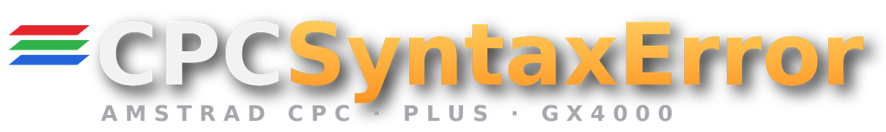
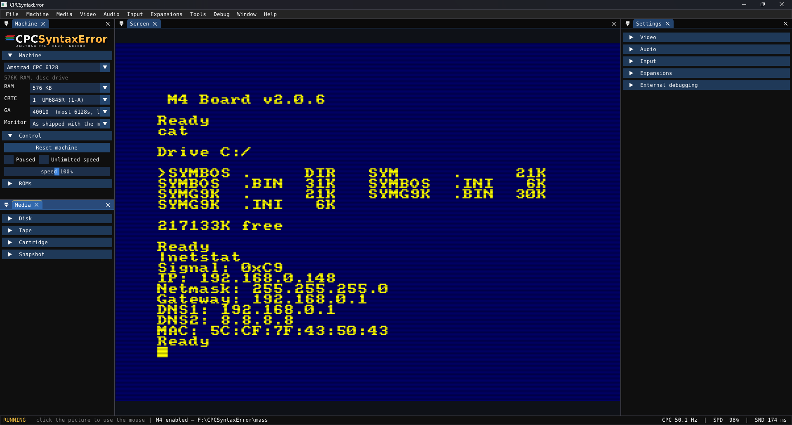
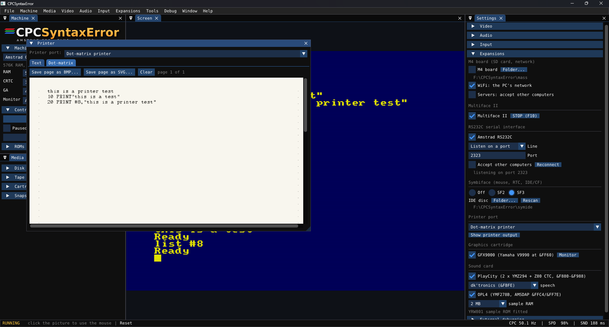

<p align="center"></p>

# CPCSyntaxError

CPCSyntaxError is an emulator for the Amstrad **CPC 464, CPC 6128, CPC Plus and GX4000**.
It runs on Windows, Linux and macOS. It has a cycle-level model of the chips of the machine.

> **This is work in progress.** The video chips, the Z80 and the other chips of the CPC are
> complete. Work continues on the user interface and on some expansions. Refer to
> [Project status](#project-status).

- [Screenshots](#screenshots)
- [Features](#features)
- [Getting started](#getting-started), [Keys](#keys), [Command line](#command-line)
- [External debugging](#external-debugging), [CSL scripts and SSM screenshots](#csl-scripts-and-ssm-screenshots)
- [Building from source](#building-from-source), [Source layout](#source-layout)
- [Project status](#project-status), [Known issues](#known-issues), [Credits and licence](#credits-and-licence)

## Screenshots

| | |
|---|---|
|  |  |
| *Batman Forever on a CPC 6128* | *Pinball Dreams on a CPC 6128* |
|  |  |
| *Alcon 2020 on a GX4000* | *Sonic the Hedgehog on a GX4000* |
|  |  |
| *The M4 board: the SD card, and `\|NETSTAT` on the network of the PC* | *The dot-matrix printer and the expansion settings* |
|  | |
| *SymbOS on a CPC 6128, with the memory map* | |

## Features

### The machine

- **All five CRTC types** are available:
  - Type 0: HD6845S / UM6845
  - Type 1: UM6845R
  - Type 2: MC6845
  - Types 3 and 4: the ASICs of the Plus and the cost-down CPC

  Each type has its own rule set. The rules come from the *Amstrad CPC CRTC Compendium* by
  Longshot. The SHAKER test suite by Longshot and photographs of real machines check them.
- **The Gate Array** models are 40007, 40008, 40010 and the ASICs 40226 and 40489. Each model
  has its own pixel timing. Select the model in **Machine → Gate Array**.
- **The monitor** models are the CTM 640/644, CM14, GT 64/65 and MM12. The monitor locks to
  the composite sync that the Gate Array makes.
- **The Z80** passes ZEXDOC, ZEXALL and all the tests of z80test 1.2a by Patrik Rak. This
  includes the undocumented flags, MEMPTR, SCF/CCF on a Zilog chip and interrupted block
  instructions.
- **The PSG, the PPI, the disc controller and the tape** agree with their data sheets and
  formats: the AY-3-8912, the 8255, the NEC uPD765A as Amstrad connected it, and TZX 1.20.
- **The CPC Plus ASIC** has sprites, DMA sound, the 4096-colour palette, raster interrupts,
  split screen and soft scroll.
- The machines are the CPC 464, CPC 6128, 464 Plus, 6128 Plus and GX4000. RAM expansions go
  up to 4 MB. Joysticks, game controllers and the analogue port of the Plus are available.

### Discs and tapes

- **Disc images**: DSK, extended DSK, **HFE** (the format of the Gotek) and **IPF**.
- **Writes to the image**: the emulator writes the changes from a program into the image
  file, in the format of that image. An HFE file keeps all unchanged tracks bit for bit. IPF
  images are write-protected. Use Media → "Save disc and tape writes to their files".
- **The disc drive in real time**:
  - The disc turns at 300 rpm under a 250 kbit/s head.
  - The bytes of a sector come when the sector passes the head. HFE and IPF images give the
    real position of each sector.
  - A seek takes the step rate that the program sets.
  - The drive is ready when the disc turns at full speed.
  - A program that is too slow for the bytes gets an overrun, as on a real CPC.
- **The tape deck** is in the Media window and in Media → Tape. It has a counter with a reset,
  the time and the block of the tape, and a list of the blocks. Its buttons are rewind, back a
  block, play, record, pause, stop, fast forward and eject. It reads CDT, TZX, TAP and WAV.
  - **Record**: the deck records the output of SAVE. It records from the current position,
    or onto a **new blank tape**. The firmware format becomes standard turbo blocks (TZX
    &11). Other signals stay as the raw signal. **Save tape as** writes a CDT file. A
    recording on a CDT file goes back into that file.
  - **Turbo**: while the tape moves, the full CPC runs faster. The speed is up to 20 times, or
    the maximum speed of your computer. All loaders work, protected loaders too.
- **Cartridges (CPR) and snapshots (SNA)** are available. Each type of media has an **Eject**
  command. You can drop a file on the window.

### Cheats

- Use **Tools → Cheats** to find where a game keeps a value: lives, ammunition, time or energy.
- **The walkthrough** asks only for what you see on the screen:
  1. Type the number that the game shows now.
  2. Play until the number changes. Type the new number.
  3. Do step 2 again until one or two places stay.
  4. Select the value that you want. The emulator keeps the value there.
  5. Tell the emulator if the cheat works. If it does not, the emulator tries each place
     one at a time.
- For a bar with no number, tell the emulator if the bar went down, went up or did not
  change.
- The search finds all the usual formats at the same time: the value, the value minus one,
  and BCD. It searches all the RAM, the 128K banks too.
- **The Search tab** gives the same search by hand, for 8-bit and 16-bit values, with undo.
- You can type **POKEs** from a magazine.
- The emulator keeps the cheats for a game in a file next to the game, `<game>.pok`. The
  cheats load with the game, switched off.

### Expansions

Select the expansions in the **Expansions** menu or in the Settings window.

- **M4 board**:
  - A folder on your PC is its SD card.
  - The ROM of the M4 (`M4ROM.ROM` by Duke, [spinpoint.org](http://www.spinpoint.org)) is
    included with his permission. It runs without changes.
  - Files and long names work from BASIC: `|CD`, `CAT`, `|LS`, `|ERA`, `|REN`, `|COPYF`.
  - **A DSK image on the card opens as a folder**: type `|CD,"game.dsk"`, then use `CAT`,
    `LOAD` and `RUN`.
  - **SymbOS** reads and writes the card sector by sector.
  - **The WiFi** uses the internet connection of your PC. CPC programs open TCP sockets, find
    names and run servers. The telnet and TCP examples by Duke work. `|HTTPGET` and `|HTTPMEM`
    download plain HTTP files, as on the real board. `|NETSTAT` shows the network.
- **Multiface II**: F10 is its STOP button. The menu, save and reload work. The ROM is from
  Romantic Robot and is not included. Put a file with "multiface" in its name in `roms/`.
- **RS232C serial interface** (from Amstrad and Pace): this card has a Z80 DART and an 8253 at
  `&FADC` and `&FBDC`. Its line can be one of these:
  - a TCP port for other programs (for example `telnet localhost 2323`)
  - a connection to a host (a BBS or a telnet server)
  - a serial port of your PC
  - a loopback plug

  The ROM of the card is not included. Put it in a ROM slot.
- **Symbiface II and III**: the mouse, the clock and the **IDE/CF interface**. The IDE drive
  is a folder on your PC: `symide` next to the program, or a folder that you select. SymbOS
  reads and writes it as one FAT16 partition.
- **GFX9000** (Yamaha V9990 at `&FF60`): all the screen modes, sprites, cursors and blitter
  commands. The blitter takes its real time, and the **/WAIT** signal stops the Z80 while the
  chip is busy. The picture of the GFX9000 can be next to the CPC picture or in its own
  window. It can also share one monitor, with a switch or through a **Video9000**.
- **OPL4 sound card** (YMF278B, on the AMSDAP at `&FFC4` and `&FF7E`): 18 FM channels and 24
  wavetable channels, for the sound daemon of SymbOS and for SymAmp. The General MIDI samples
  need the YRW801 ROM from Yamaha. It is not included. The emulator asks for it.
- **PlayCity** (two YMZ294 and a Z80 CTC at `&F880` to `&F988`): six more AY channels in
  stereo, the clock of the CTC, raster NMIs and IM2 timer interrupts.
- **Speech**:
  - The **SSA-1** from Amstrad and the **dk'tronics** speech unit use the SP0256-AL2 (the MAME
    core). Its ROM is not included. The emulator asks for it.
  - **LambdaSpeak 3**: its Epson and DECtalk speech uses the voices of your computer. These are
    the Windows voices, `say` on macOS and `espeak-ng` on Linux. Its serial **MP3 module**
    plays MP3 files from a folder.
- Lightguns (Trojan Light Phazer, Gunstick, West Phaser), a text or **dot-matrix printer** on
  the printer port, and the DigiBlaster and AmDrum. You can save printer pages as BMP or SVG.
- **Drive and keyboard sounds**: the drive motor, the head steps, disc insert and eject, and
  key clicks. They are recordings in `sounds/`. You can replace them with your own WAV files.

### Tools

- **The debugger** (Debug menu):
  - Run, step into, step over and step out.
  - The registers, flags and stack of the Z80, next to the disassembly with labels.
  - Breakpoints with conditions, and memory watchpoints.
  - **Chips**: live views of the CRTC, the Gate Array, the monitor, the Plus ASIC, the PSG,
    the PPI, the keyboard matrix, the disc controller and the tape.
  - **Memory**: a hex editor and a **memory map**. The map shows one pixel for each byte of a
    64K bank. The colour shows what the Z80 did there: opcode fetch, operand, read or write.
  - **GFX9000**: its picture, registers, palette, command engine and VRAM.
- **The DSK editor** (Tools, or Media → Drive → Edit):
  - Make new discs in all the CPC formats: DATA, SYSTEM, IBM, 42 or 80 tracks, ParaDOS,
    ROMDOS, Vortex, Dobbertin, or your own geometry.
  - Open standard and extended images, or edit the disc in a drive while the CPC uses it.
  - Files: import, export, delete, rename, change the user and the flags. View a file as hex,
    BASIC, text or Z80 code.
  - Tracks and sectors: the IDs, the status bytes, the weak copies, and the bytes in a hex
    editor. A map shows the owner of each block.
- **The assembler** is [RASM](https://github.com/EdouardBERGE/rasm), included in the program.
  Press F9 to assemble into the memory of the running machine. Press Ctrl+F9 to assemble and
  run. You can change the colours of the syntax.
- **External debugging and code loading**: a **GDB server** for
  [DeZog](https://github.com/maziac/DeZog) in VS Code, a **command API** with the `cpcse-ctl`
  client, and an **auto-reload** of your build. Refer to [External debugging](#external-debugging).
- **CSL scripts and SSM screenshots**: these are the CPC Script Language 1.5 and ScreenShot
  Management 1.1 standards by Longshot. `cpcse.exe --csl <script>` runs a script with no
  window. The SHAKER scripts run in this mode. Refer to
  [CSL scripts and SSM screenshots](#csl-scripts-and-ssm-screenshots).

### The interface

- The windows dock and change size (Dear ImGui, docking branch). You can move each window out
  of the main window.
- At the start, only the screen, the machine and the media windows are open. Open the other
  windows from the menus. They dock with their group.
- Use **Window → Interface size** to make the interface larger (90% to 200%).
- The file picker shows all the drives (C:, D: and more on Windows). You can type a folder
  name into it. The Save dialog works the same way. Files with all types of names open,
  for example accented, CJK and emoji names (Windows 10 1903 or later).

## Getting started

1. Download `CPCSyntaxError-win64-<version>.zip` from the [Releases](../../releases) page.
2. Unzip it into a folder.
3. Run `cpcse.exe`. You can also build the program yourself (refer to
   [Building from source](#building-from-source)).

The firmware ROMs of the CPC 464 and CPC 6128 and the system cartridge of the CPC Plus and
GX4000 are included in `roms/`. Amstrad gave permission to distribute their copyrighted
material. Amstrad keeps that copyright.

`cpcse.exe` looks for the `roms` folder next to it. To use another folder, use **File → ROM
folder…** or `cpcse.exe --roms <folder>`. The emulator finds each file by its name. Upper and
lower case are the same.

| For | The file name must contain |
|---|---|
| CPC 464 | `464 OS`, `464 BASIC` |
| CPC 6128 | `6128 OS`, `6128 BASIC`, `AMSDOS` |
| 464 Plus, 6128 Plus, GX4000 | `burning rubber` (the system cartridge, a `.cpr` file) |
| M4 board | `M4ROM` (included) |
| Multiface II | `multiface` (not included) |
| OPL4 General MIDI samples | `yrw801` (not included, the emulator asks for it) |
| SSA-1, dk'tronics, LambdaSpeak 3 speech | `sp0256-al2.bin`, 2 KB (not included, the emulator asks for it) |

The first start uses a CPC 6128. To use another machine, use **Machine → Model**. To load
software, use the **File** or **Media** menu, or drop a file on the window.

The emulator saves the settings in `cpcse.ini` and the window layout in `cpcse_layout.ini`.
These files are next to the program. **Window → Reset layout** sets the default layout again.

## Keys

| Key | Action |
|---|---|
| F11 | Fullscreen (or double-click the picture) |
| Ctrl+R | Reset |
| Ctrl+P | Pause or run |
| F10 | The STOP button of the Multiface II |
| F5 | Run or pause (in a debugger window, or when paused) |
| F7, F8, Shift+F8 | Step into, step over, step out |
| F9, Ctrl+F9 | Assemble, assemble and run (in the assembler window) |
| F12, middle button | Release the mouse (click the picture to give the mouse to the Symbiface) |

The keys go to the CPC. The exception is when a debugger or assembler window has the focus.

## Command line

`cpcse.exe --roms <folder>` starts the emulator with another ROM folder.
[External debugging](#external-debugging) shows the options `--gdb`, `--api`, `--load`,
`--watch`, `--run`, `--reset`, `--command` and `--symbols`.

A headless screenshot mode is available for scripts:

```
cpcse.exe --shot out.bmp --model cpc6128 --frames 200 [--disk game.dsk] [--type "RUN\"GAME\n"]
          [--cart file.cpr] [--tape file.cdt] [--sna file.sna] [--savesna out.sna]
          [--crtc 0-4] [--gate-array 40007|40008|40010] [--beam] [--ram 64-4160]
          [--disk-writeback] [--record-tape out.cdt]
          [--m4 <folder>] [--multiface] [--sf2] [--sf3] [--ide <folder>] [--xrom <slot>=<rom file>]
          [--serial tcp:<host>:<port>|listen:<port>|com:<port>|loopback]
          [--gfx9000] [--v9990-shot gfx.bmp] [--video9000-shot mixed.bmp]
          [--opl4] [--playcity] [--speech ssa1|dktronics|lambdaspeak3] [--mp3card <folder>]
          [--dac digiblaster|amdrum] [--wav out.wav]
          [--mouse "w120;j5,60;j16,2;tDIR;kEnter;s<file.bmp>"]
```

- `--type` types its text after the machine starts. `\n` is the Enter key.
- `--disk-writeback` writes the changes from the program into the disc file. This is off in
  headless mode and on in the window.
- `--record-tape` puts a blank tape in the deck and starts to record. At the end, the
  emulator saves the tape in that file.
- `--mouse` runs a small script after all the other steps. The commands are: `w` (wait
  frames), `m` (move the mouse), `c` (click), `d` (double-click), `j` (hold the joystick,
  `j<bits>,<frames>`), `t` (type text), `k` (tap a key) and `s` (save a screenshot). This is
  sufficient to control a desktop such as SymbOS with no window.

The models are `cpc464`, `cpc6128`, `cpc464plus`, `cpc6128plus` and `gx4000`.

The headless modes write to the Command Prompt that started them. `cpcse.exe` is a windowed
program, thus the prompt does not wait for it. In a batch file that needs the result, use
`start /wait cpcse.exe ...`.

## External debugging

Write your code in VS Code (or another editor), and let the emulator follow your build. These
functions are off until you switch them on. Use *Settings → External debugging* or the
command line. The servers listen on `127.0.0.1` only.

- **GDB server** (`--gdb`, port 12000): the `mame` remote of DeZog connects to it. It gives
  source-level debugging with breakpoints, steps, watchpoints, and views of the memory and
  the registers.
- **Command API** (`--api`, port 6128) and `cpcse-ctl` (next to `cpcse.exe`): load code,
  type, read and write memory, set breakpoints, wait for a stop and take screenshots.
- **Auto-reload** (`--watch build/game.bin@0x4000 --run entry`): the emulator writes each new
  build into memory and starts it again.

```
cpcse.exe --gdb --api --watch build/game.bin@0x4000 --run entry --symbols build/game.sym
cpcse-ctl load build/game.bin 0x4000 entry
```

[docs/external-debugging.md](docs/external-debugging.md) gives the DeZog `launch.json`, a
build task, all the options and all the commands.

## CSL scripts and SSM screenshots

`cpcse.exe --csl <script>` runs a CPC Script Language file with no window. The emulated program
asks for screenshots with SSM codes (the Z80 bytes `ED LL ED HH`). The emulator saves each one
as `CPCSE_<crtc>_<HHLL>.bmp`. This is the name format that the SSM standard gives for the
SHAKER portal. This mode runs only when you give `--csl`.

```
cpcse.exe --csl SHAKE27A-1.CSL --out shots --disk-dir <folder with shaker27.dsk>
```

| Option | Function |
|---|---|
| `--out <dir>` | The folder for screenshots, snapshots and `csl.log` (default `screenshots`) |
| `--roms <dir>` | The firmware and the Plus system cartridge (default `roms`) |
| `--disk-dir`, `--tape-dir <dir>` | The folders for the media that a script names |
| `--model <id>` | The machine for a script with no `cpc_model` (default `cpc6128`) |
| `--crtc <n>` | Use this CRTC type (0 to 4) for each `crtc_select` |
| `--emu-name <name>` | The prefix of the image names (default `CPCSE`) |
| `--csl-log <file>` | The log of the run (default `<out>/csl.log`) |
| `--no-chain` | Do not follow `csl_load` |
| `--no-errata` | Run published scripts exactly as written (refer to the erratum below) |

The player knows all the CSL 1.5 instructions:

- `wait_ssm 0xHHHH`: the script waits until the program sends that SSM code and its
  screenshot is saved.
- Machine configuration: `cpc_model`, `crtc_select` (0, 1, 1A, 1B, 2, 3, 4), `gate_array`,
  `memory_exp`, `rom_dir`, `rom_config`.
- `reset soft` and `reset hard`.
- Disc, tape and snapshot media, and their folders.
- Keys: `\(...)` codes, `{groups}`, `\(KOF)`, `key_from_file`, `keyboard_write`.
- The four wait instructions.
- Screenshots and snapshots (versions 1 to 3), with their names and folders.
- `csl_load`.

`crtc_select 3` with no model makes a 6128 Plus, because CRTC 3 is its ASIC. The player
goes from its menu to BASIC before the script starts. SSM `#0000` ends a `wait_ssm0000`.
`#FFFE` saves the named screenshot and `#FFFF` saves a snapshot. If the machine cannot do an
instruction, the script stops with the report that the standard gives. The report contains the
script, the line, the instruction, the reason, the CSL version of the script and the supported
version.

**Erratum.** SHAKER 2.7 added a ninth sub-test ("R4 & R9 check") to its test U. The
SHAKE27A-*.CSL scripts do not include this change. The test now ends 14.2 s to 14.7 s after
its key, but the script continues after 14 s. Thus the script does not get to the next five
AI screens. The player makes that one wait 16 s long and writes this in the log. `--no-errata`
switches this change off.

## Building from source

### Windows

You need:

- a MinGW-w64 GCC with C++17 (GCC 10 or later)
- CMake 3.16 or later
- Ninja (optional)
- the **SDL2 MinGW development package** (`SDL2-devel-2.x.x-mingw.zip` from
  <https://github.com/libsdl-org/SDL/releases>)

```
cmake -S . -B build -G Ninja -DSDL2_ROOT=C:/path/to/SDL2-2.x.x/x86_64-w64-mingw32
cmake --build build
```

Alternatively, put the `x86_64-w64-mingw32` folder of the SDL2 package into
`third_party/SDL2` and run `build.bat`.

The result is `build/cpcse.exe` and `build/cpcse-ctl.exe`. The build copies `SDL2.dll` and
the `roms` folder next to them. The GCC runtime is linked statically. You do not need more
files to run the program.

### Linux

You need GCC 10 or later (or Clang), CMake 3.16 or later, Ninja (optional), pkg-config, and
the SDL2 and OpenGL development packages. On Debian and Ubuntu:

```
sudo apt install build-essential cmake ninja-build pkg-config libsdl2-dev libgl-dev
cmake -S . -B build -G Ninja
cmake --build build
./build/cpcse
```

The result is `build/cpcse`. The build copies the `roms` and `sounds` folders next to it. Run
the program from that folder, or give `--roms <folder>`. The program looks for the drive and
keyboard sounds in `sounds/` next to the program, then in the working folder.

On Linux, the GUI runs CSL scripts with `fork` and `exec`. It opens folders with `xdg-open`
and downloads ROMs with `curl` (or `wget`). The paths in CSL scripts from Windows are not case
sensitive.

### macOS

You need the command-line tools of Xcode (Apple Clang), CMake 3.16 or later and SDL2, for
example from Homebrew. Macs with Apple silicon and Intel Macs use the same procedure:

```
xcode-select --install
brew install cmake ninja sdl2
cmake -S . -B build -G Ninja
cmake --build build
./build/cpcse
```

The interface uses OpenGL 3.2 (Core Profile). All Macs since 2011 have it. As on Linux, the
build copies the `roms` and `sounds` folders next to `build/cpcse`. Folders open with `open`.
Users report that the macOS build works. We did not test it here.

## Source layout

```
src/core/      The emulation core (a static library with no host dependencies)
src/gui/       The desktop program: SDL2, OpenGL and Dear ImGui, the debugger, the assembler,
               the cheats, the GDB server and the command API
tools/ctl/     cpcse-ctl, the client for the command API
docs/          external-debugging.md
roms/          The Amstrad firmware, the Plus system cartridge and the M4 ROM
               (refer to roms/README.txt)
sounds/        The drive and keyboard recordings
third_party/   Dear ImGui (docking branch), RASM, ymfm, the SP0256 core, minimp3, the SPS
               decoder library (for IPF, non-commercial licence) and the DejaVu Sans Mono
               font. SDL2 is not included.
```

## Project status

| Area | Status |
|---|---|
| CRTC types 0 to 4, Gate Array, monitor | Complete. The rule sets come from the Compendium. Independent reference models and SHAKER check them. |
| Z80 | Complete. It passes ZEXDOC, ZEXALL and all of z80test 1.2a. |
| PSG, PPI, disc controller, tape | Complete. They agree with their data sheets and formats. The CPC firmware checks the disc timing and the tape SAVE. |
| CPC Plus ASIC | Working. Its picture uses the same monitor model as the picture of a CPC. |
| Disc images | DSK and extended DSK: read and write. HFE: read and write. IPF: read (with the SPS library). |
| Cheats | Working. The walkthrough and the search are tested on a running CPC. |
| CSL and SSM | Complete (CSL 1.5, SSM 1.1). |
| DSK editor | Working. AMSDOS checks its file system (LOAD, SAVE, ERA, read-only). |
| User interface | All options are available, in the menus Machine, Media, Video, Audio, Input, Expansions, Tools and Debug. Work continues. |
| M4 board | Working. Files, DSK images and raw SD sectors use a folder on the PC. The ROM source of the M4 checks them. The WiFi uses the network of your PC. |
| Multiface II | Working: STOP, the menu, save and reload. |
| Symbiface II and III | Working: the mouse, the RTC and the IDE/CF interface. The ATA standard and SymbOS check them. |
| GFX9000 (V9990) and Video9000 | Working. The data comes from the application manual from Yamaha and from tests of a real V9990 on a CPC. The blitter speeds are from the measurements of openMSX. |
| OPL4 (YMF278B) | Working (the ymfm core). It needs `yrw801*.rom` for the General MIDI samples. |
| SSA-1 and dk'tronics speech | Working (the SP0256 core from MAME). It needs `sp0256-al2.bin`. |
| LambdaSpeak 3 | Working: the Epson and DECtalk modes (with the voices of your computer), the SSA-1 and dk'tronics modes and the MP3 module. Not yet available: the SSA-1 speech without an SP0256 ROM, the EEPROM sampler and the Amdrum mode. |
| DigiBlaster and AmDrum DACs | Working. |
| Drive and keyboard sounds | Working. They are recordings of an Amiga 600 drive and a PC keyboard. You can put your own recordings in `sounds/`. |
| RS232C serial interface | Working. The data sheets of the chips check it, and a CPC talks through it over TCP. It is not yet tested with the ROM of the card. |
| PlayCity | Working. Its NMI and IM2 timers follow the Z80 CTC manual. They are not yet tested with PlayCity software. |
| Lightguns, printers | Working. Only some tests are done. |

## Known issues

- **The C-HSYNC width on CRTC 0 and 2.** On these chips, the monitor sync of the Gate Array is
  a small part of a microsecond longer than the table in the Compendium (§14.4, p.134). The
  emulator does not use the width in the table yet. The monitor model does not yet show how
  the monitor recovers after a short sync. Without that model, the table width makes some
  pictures worse.
- **SymAmp under SymbOS.** SA2 songs for 60 Hz or 70 Hz that set their speed in the pattern
  play approximately 1.4 times too slowly. The cause is the player of SymAmp, not the
  emulator. A real CPC plays them at the same speed. MP3 playback is not available, because it
  needs an MSX MP3 cartridge. The emulator does not have that cartridge.
- **GFX9000.** Tests on real hardware show that some commands sometimes fail (a command that
  uses DY or NX/NY again can go wrong or stop). The emulator does not do this. The colour order
  of LMMV with DIX=1 is approximate.

## Credits and licence

CPCSyntaxError has the MIT licence (refer to `LICENSE`). The third-party parts keep their own
licences. Refer to `THIRD_PARTY_NOTICES.md`. Two licences permit **non-commercial use only**:
the Exomizer cruncher in the assembler, and the SPS decoder library for IPF images. The MIT
licence does not cover the Amstrad firmware and the system cartridge in `roms/` (refer to
`roms/README.txt`).

The CRTC data comes from the **"Amstrad CPC CRTC Compendium" by Longshot** (CC BY-NC-ND 4.0).
His SHAKER test suite checks it. The CSL and SSM formats are also his standards.

- The assembler is **RASM by Edouard BERGE**.
- The M4 ROM is by **Duke**.
- The **SPS decoder library** (KryoFlux Products & Services) reads IPF images.
- The user interface uses **Dear ImGui** by Omar Cornut, and **SDL2**.

Amstrad CPC, CPC Plus and GX4000 are trademarks of their owners. This project has no
connection with Amstrad.
